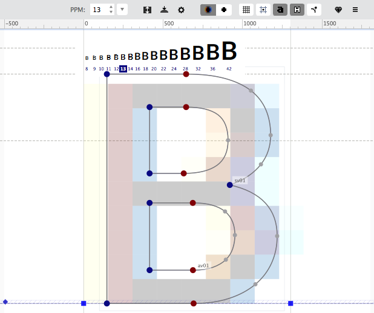
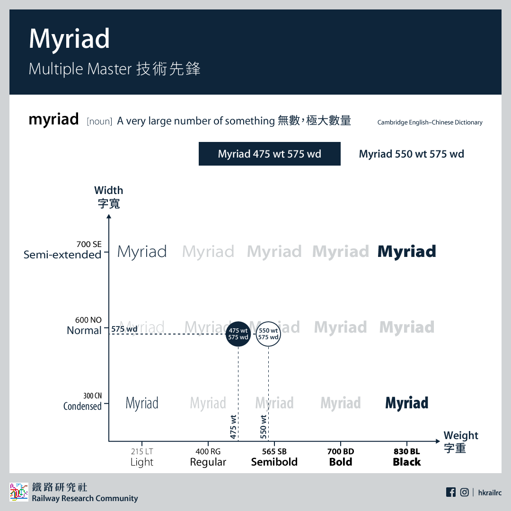
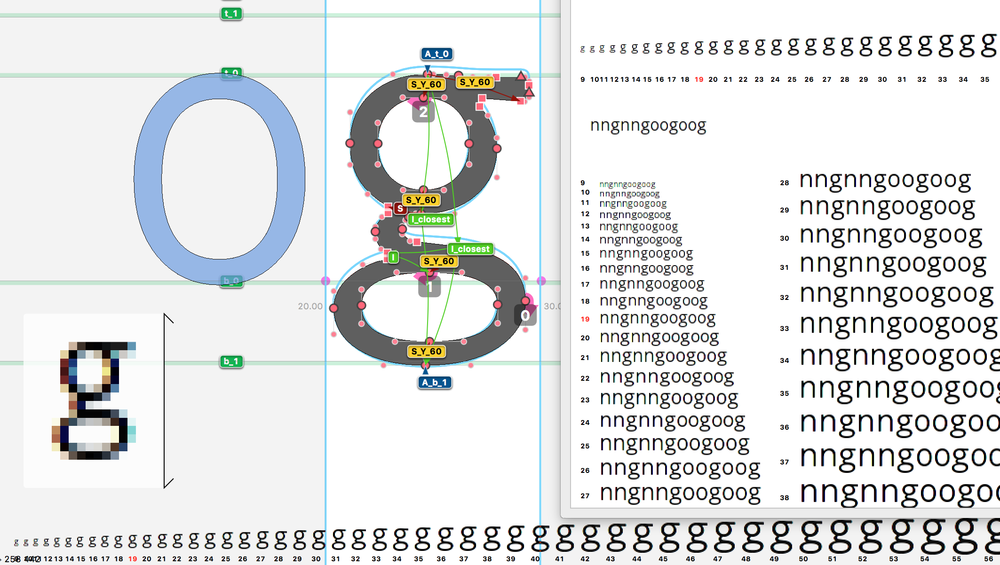

# 数字字体的发展

随着今天显示硬件变得越来越好，比如retina、4k屏等，对于数字字体的历史，经历了哪些变化？伴随这个问题回溯下数字字体的发展史。

在之前字体的发展实际上相当久远，从早期如甲骨、印章刻字到雕版印刷、活字印刷；西方铅字印刷技术再到打字机出现等，字体排版出现了巨大的变化，而字体字形也发生了很大的变化。

说到数字字体，它的起源至少可以追溯到20世纪50年代个人打字机、打印机时代。

## 个人打字机

战后文字行业爆发式的增长，使得印刷排版技术发生了翻天覆地的变化，这也为未来数字字体革命铺平了道路。

### IBM 电动打字机

当年传统的打字机工作原理是：每个字符对应了一个铅条，当按下字符按键时，铅条敲击纸张完成打字，这种打字机很容易卡住，很影响打字，效率很低。
IBM当1961年推出了一款这样的打字机: IBM Selectric<sub>1<sub>:

  

区别在于它通过一个『球体』样子替换传统意义上的铅条，做到打字时从不卡壳，而且可以通过更换小球，打印出不同粗细、字号、斜体的字符。下面是多个打印头：  

  

自此，打字员可以在一篇文章里使用不同的字体和字形。

### 菊轮打印机

  
施乐公司出品的菊轮打印机<sub>2</sub>，看似只是用菊花形状打印头替换了球状打印头，让打字速度提高了2、3倍，更重要的是它让个人打印机在处理非等宽字体时提供了合适的字间距，并且能随着字体大小变化进行等比变化。

因为打字效率非常高，加上价格非常亲民，即使是在70年代晚期激光和点阵打印技术被发明，菊轮打印机仍然广泛被使用。

## 照相排版技术

在工业印刷领域，主要创新来自于使用照相排版技术，最初是在1949年一家叫Photon的公司提出的，以光的形式替代了以前排版使用的铅型模具。

  

它的原理是，操作员把光线调整投射到圆盘上的字母，然后选择不同尺寸的放大镜来调整字号，最后光线经过定位器成像在感光纸或者胶片上，不断重复这个过程，文字就像变魔术般逐个出现了。

照相排版技术其实与老式的有一种叫做古腾堡排版<sub>3</sub>的技术类似，区别在于光替代了物理的铅模具或者流体金属。  

### 电子照相排字机

Rudolf Hell<sub>5</sub>在1966年发明了电子照相排字机，它通过阴极射线管CRT(跟旧的电视成像技术一样)来实现照相排版。

成像逻辑是相似的，但成像原理最大区别在于它并不是光通过照射物理的字符呈现在感光纸上，而是元素被分割成许多个相等大小的格子(相当于像素)，然后通过投射不同格子来呈现不一样的字符，后来这种格式也被叫做位图格式。

更厉害的是，CRT附带一个可编辑终端，能够方便的修改最终展示在屏幕的内容。这个时候信息已经完全数字化了，实际上可以将这些内容存在软盘里了。

可以说电子照排机更像是个人桌面电脑的先驱，虽然体积相差了很多个量级。

## 数字时代的字体

排版技术不断进步，为了适应新的机器和技术，字体也在发生者变化。
字体设计师们都在想方设法设计更清晰更适合于照排机的字体，1957年由Adrian Frutiger6发明的univers7字体，是用来取代一种叫Futura的字体的无衬线字体<sub>附录1</sub>。  
univers字体家族目前包含44种字体，分别由根据字重、宽度、不同程度斜体及支持字符集等构成：

  

### Digi Grotesk


这是第一款真正意义上的数字字体。Rudolf Hell在1968年发明了它，并在电子照排机上使用。通过点阵图技术首次呈现在屏幕上。它也是一种无衬线字体。

## 个人电脑时代来临

八十年代，个人计算机时代来临。字体排版、打印技术都获得飞速的发展。

### 『超前理念』

照相排版到数字排版早期，因为技术不成熟，实际上电脑和旧的照排机印刷效果都很差。1977年Donald Knuth<sub>11</sub>在写《计算机程序设计艺术》这部书时，觉得当时的字体设计软件设计出的字体都粗糙丑陋，破坏了这本书的美感。于是他暂停了写书，顺道先写了一个字体设计软件Metafont，并且通过它设计了Computer Modern<sub>12</sub>字体，他写的另外一个更为人熟知的是TeX<sub>14</sub>字体排版软件。

当年的字体设计软件主要是控制字体轮廓来产生的矢量字体，整体比较粗糙。

*1974矢量字体：*


Metafont的特点是它通过更多程序参数变量控制字体的呈现，比如单个字体的宽度、高度、倾斜度、衬线的长度、弯曲程度等，给字体设计师更精细的控制字体的能力。

*下面是通过Metafont实现的一个字体，更像是在画一个字*：

```
%file name: beta.mf
%mode_setup;
% Define a beanlike shape for the character B
beginchar("B",11pt#,11pt#,0);
  % Setup coordinates as an equation system
  y1=y2=y3=0;
  y4=y5=y6=h;
  x1=x4=0;
  x2=x5=w;
  x3=x6=2*w;

  % Define pen
  pickup pencircle xscaled 0.2w yscaled 0.04w rotated 45;

  % Draw the character curve
  draw z1..z3..z6{z2-z6}..z5..{z4-z2}z4..cycle;
endchar;

end
```

会画出下面的字体：


理念实在太超前了，通过程序60多个变量可以精细化控制每一个字体的曲线，然而当时并没有所见即所得的预览工具来实时看到字体变化，对于设计师来说想要设计一款不一样的字体成本实在太高，也是软件没火起来的主要原因，不过多年后终于还是被微软跟苹果分别实现。

### 字体『三角大战』

### Adobe和苹果之PostScript

1983年苹果推出了lisa，第一台图形化用户界面的电脑，然而有个问题摆在面前：没法把复杂图形界面设计的内容通过某种信息转换打印到纸上。

同一时期两个年轻人从施乐辞职创立了Adobe，两年后推出了PostScript这个页面描述语言，它负责把数字字体信息转换成打印机识别的矢量字体信息，这项技术正是苹果需要的。乔布斯认准了个人数字图形的排版及高清打印未来会火，于是怂恿Adobe把PostScript推广到个人打印机上，并且苹果买入了大量Adobe的股票。

装有PostScript处理程序的打印机，把矢量文字的轮廓数据转化为高分辨率图像，此过程也被称作栅格化。苹果当年跟佳能合作也推出了首款支持PostScript技术的打印机LaserWriter，能够将Macintosh<sub>15</sub>上设计的内容以高精度文字及图像形式打印在纸上。


Adobe阶段性推出了几款字体文件格式: PS type 1、2、3、42(银河系漫游指南迷懂得)。

相比Adobe在完善自己的产业链，苹果也在完善自己的体验闭环，1985年苹果联系一家叫aldus(后来被Adobe收购)的公司，推出了苹果版本的PageMaker，支持用PostScript字体来设计内容，然后再通过LaserWriter打印出来。

下面Adlus创始人和MageMaker的UI界面：


接下来三家配合默契，Adobe为了推广PostScript，制作了一系列高质量的字体库，有的经典字体比如Helvetica直接购买授权，另外一些则是重新设计；而aldus公司专注排版软件开发；苹果的Mac电脑搭配着这些技术为广大设计师们所欢迎。

这时候对于苹果来说，系统体验的存在硬伤：排版软件无法对将要打印出的内容做到实时预览。主要原因是PostScript在打印机上那套栅格化引擎是封闭的，Adobe并不想开放。而苹果希望Adobe能将此项技术进行授权。但Adobe不想开放，原因主要在于：一个是苹果一旦拿到PostScript栅格化技术，很有可能分掉Adobe的蛋糕。第二苹果一旦把栅格化移植到Mac上做到实时预览，意味着打印机仅需要处理图像即可，打印机厂商再也无需为Adobe的栅格化付费。最终在栅格化技术转让上两家公司撕破脸皮，苹果决定Adobe结束了合作。

### 苹果和微软之TrueType



实际上苹果野心很大，它希望推出一套涵盖字体设计、制作到排版、打印整个过程的技术，彻底摆脱Adobe的技术。于是在1987年投向老冤家微软，希望能借助微软的技术实力实现目标。

在此背景下，诞生了TrueType的技术。从前面我们看到，市场主要分为：打印排版技术及个人计算机设计排版两部分。微软负责打印排版技术部分，对应的是Adobe的PostScript打印机栅格化引擎，称作TrueImage(最终也没火起来，被微软拿来换取苹果的TrueType技术授权)；而苹果负责在操作系统中内置栅格化引擎实现实时预览功能，代号是Royal，而计划伊始苹果就决定走adobe不一样的路线：将所有技术规范公开，不收取任何授权费，同时苹果迅速出售了Adobe的股份，跟Adobe彻底闹掰。

对于TrueType字体技术，苹果有更大的规划，希望能开发一套完整的字体套件，集成在Mac OS系统内，被称作 TrueType GX。

苹果跟微软的TrueType计划，迫使Adobe在1989年开放了PostScript type 1的全部技术规范，同时在次年迅速推出了一款能够在电脑实时预览type 1字体的软件：ATM(Adobe Type Manager)，并声称只要Mac安装了该软件就可以像TrueType一样预览type 1的字体。


除了消费者的便利以外，在字体设计功能性方面，两方也在叫着劲。首先是Adobe在ATM上推出一项名为Multiple Masters的技术，像之前Metafont的理念一样，通过程序更多的参数可以控制字体的细节，从而创造新的字体。MM的特点是允许设计师对字体进行插值无极变换，什么意思呢？比如说指定母版两端字体的字宽、字重，就可以调出中间任何字宽字重，比如下图基于MM设计Myriad字体的变换。



当时距离TrueType GX发布还有几个月，MM的消息一出，苹果也决定在TrueType上实现类似的插值无极变换技术，在最后发布时GX确实也支持了此项技术，被叫做TrueType GX Variations，但它实现方式与MM不同。

我们对比下这两个回合双方拿出来的技术：

#### Round one: TrueType vs PostScript

当年TrueType和PostScript方式均以轮廓缩放控制字体，通过贝塞尔曲线来描述轮廓，TrueType优秀的地方在于它提出了渲染提示(hinting)的概念。通过两种技术设计的字体，大都能做到很好的轮廓缩放。但如果只是简单缩放轮廓时，经过栅格化显示出的图像可能会非常丑陋，渲染提示实际上是告诉栅格化引擎如何处理缩放时候像素的排布。

PostScript早先设计是服务于打印技术的，因此对于描述曲线的控制有限，主要在于引擎本身对字体渲染时的优化微调；而TrueType的hinting技术则是把控制权交给设计师，设计师可以调整字体在缩放时的变形程度、调整轮廓扭曲等，更适合于处理字体的屏幕显示。



TrueType在设计字体时给了设计师跟高的自由度，但如果想做到字体的精确控制需要耗费大量精力，也非常考验设计师的设计能力。如果苹果选择了Adobe做PostScript字体的思路，由官方设计多款经典字体，也许结果会有所不同吧。然而苹果选择了完全开放，以至于市场充斥泛滥的免费但质量良莠不齐的字体，也让TrueType蒙受阴影。

#### Round two: Multiple Master vs TrueType GX Variations

MM首先推出了插值无极变换技术，并且官方通过这项技术做出了几款精美的字体，还适配了一系列经典字体。MM通过设定两个极值的母版，进行轮廓的一种极值变换过程，比如说字重的由细变粗。如果希望变换多种字形因素，则需要准备大量对应的母板，而且对于单个字体的调整能力有限。


TrueType的无极插值理念是：一方面通过栅格化引擎在不同字号下控制像素的细微排布计算，做到提升字体的平滑度和美感；另一方面提供了delta hint<sub>22</sub>的技术，简单理解是允许在不同字号下针对单个字体进行微调的技术。


然而这两项技术的结局是：MM由于使用繁琐，最终被抛弃；而GX先进的理念因苹果失误的策略和商业竞争最终失去了市场。

### 微软和Adobe之OpenType


由于打印设备本身支持PostScript的已经足够广泛，而苹果和微软的TrueType由于开放的策略，市面上大多设计的字体都水准都很低，商家没有动力更新设备安装驱动去支持TrueType，导致在打印市场缺乏竞争力。

而设计领域，苹果的GX无极插值变换技术被集成在Mac的系统中，支持内容实时更新和很多高级排版功能。然而这个动作伤害到了排版软件的利益：原本公司花费巨大精力设计的高级排版功能，系统直接给提供了。许多排版软件选择了无视系统提供的技术，这导致了设计师们在设计TrueType字体几乎无软件可用。这时候Adobe更狠，直接收购了PageMaker软件的公司adlus，之后PageMaker在很长一段时间都不支持通过GX套件来排版设计。

苹果很受挫败，但反观微软正在通过售卖捆绑TrueType技术的操作系统盈利，当微软希望获得TrueType授权时，苹果像极了之前Adobe，拒绝了微软的授权要求。

微软被拒绝后立马投奔了Adobe，联合起来对付苹果。于是在1997年，合作推出了OpenType的技术，而第一款OpenType字体Palatino Linotype<sub>18</sub>也伴随Windows 2000预装。

OpenType吸收了TrueType技术的先进理念思想，由支持了TrueType、PostScript type 2的字体，让Adobe下定决心砍掉MM项目，并且在许多场合不遗余力的宣传推广OpenType，最后OpenType在市场反响强烈。

苹果方面则在OS 8移除了对GX的支持，并在10.4 Tiger系统开始支持OpenType，至此字体大战以苹果失利而告终。

### OpenType和排版

2016年，苹果、微软、Adobe决定联合开发，将TrueType GX可变技术融入了OpenType，同年9月14日OpenType1.8版本发布，宣布支持了可变字体技术，目前OpenType的标准仍在发展中。

而在排版技术方面，在Web发展的今天，对不同终端多语言字体的排版要求越来越精细，除此以外网站字体的排版技术标准化也有待制定。

本文旨在回溯有关数字字体的发展历程，细节不慎考究。如果有误欢迎指出。

### 附录1:  

一些相关的简单概念  

#### 字体和字形

**点阵字体**

点阵字体，也叫位图字体，多用于早期电脑(比如DOS)。


**轮廓字体**

每个字形使用贝塞尔曲线来描述轮廓，可以通过简单的数学变形来放大或缩小。但是很小的字体经常需要额外的信息（hints）指导笔画取舍进行润算，不然容易漆黑一团。

**笔画字体(Stroke-based font)**

字形的轮廓由分离的笔画顶点和笔画外形定义。它优于矢量字体之处在于：减少了定义字形的顶点数，允许同一组顶点生成不同的字体（不同的粗细，不同大小或不同衬线规则）所以节省大小。

**网络字体**

主要是使用于网页上的字体，摆脱以往字体需安装才能显示的限制，使网页设计上，用户也能够看到特殊的字体效果。

**clearType**

微软针对LCD液晶屏显示提供的一种提高文字清晰度的技术，通过次像素发光技术实现。


**无衬线字体**

无衬线字体(sans-serif)呢？它跟衬线字体是相对的，下面一张图看明白区别：


衬线字体漂亮，适合用在正文段落来阅读，有的衬线字体可以看上去很艺术；无衬线比较简洁干练，看起来比较现代，适用于标题、广告等。

**等宽字体**

字符宽度相同的电脑字体，编程可能用到比较多。比如Courier、Monaco、Menlo、Ubuntu下的文泉驿等宽正黑等。

**字形**

字重：字的粗细程度，比如通常会提供以下的至少4-6种：

```
100 - 淡体 Thin ( Hairline )
200 - 特细 Extra-light ( ultra-light )
300 - 细体 Light
350 - 次细 Demi-Light
400 - 标准 Regular ( normal / book / plain )
500 - 适中 Medium
600 - 次粗 Demi-bold / semi-bold
700 - 粗体 Bold
800 - 特粗 Extra-bold / extra
900 - 浓体 Black ( Heavy )
950 - 特浓 Extra-black ( Ultra-black )
```

倾斜：italic。  
宽度：某些字体提供了同尺寸字体下不同的宽度。


### 附录2：   

1. [IBM_Selectric_typewriter](https://en.wikipedia.org/wiki/IBM_Selectric_typewriter)
2. [daisy wheel](https://www.pcmag.com/encyclopedia/term/40702/daisy-wheel)
3. [phototypesetters printing](https://www.digitalcheck.com/phototypesetters-printing/)
4. [http://www.historyofinformation.com/detail.php?id=4776](http://www.historyofinformation.com/detail.php?id=4776)
5. [https://multimediaman.blog/tag/digiset/](https://multimediaman.blog/tag/digiset/)
6. [Adrian Frutiger](https://en.wikipedia.org/wiki/Adrian_Frutiger)
7. [Univers](https://zh.wikipedia.org/wiki/Univers)
8. [digi grotesk](https://www.fontshop.com/families/digi-grotesk)
9. [this was the first computer font](https://www.buzzfeednews.com/article/jwherrman/this-was-the-first-computer-font)
10. [http://www.designhistory.org/Digital_Revolution_pages/EarlyDigType.html](http://www.designhistory.org/Digital_Revolution_pages/EarlyDigType.html)
11. [TeX](https://zh.wikipedia.org/wiki/TeX)
12. [Computer Modern](https://zh.wikipedia.org/wiki/Computer_Modern)
13. [https://book.douban.com/subject/1130500/](https://book.douban.com/subject/1130500/)
14. [TeX](https://zh.wikipedia.org/zh-hans/TeX)
15. [https://zh.wikipedia.org/zh/%E9%BA%A5%E9%87%91%E5%A1%94](https://zh.wikipedia.org/zh/%E9%BA%A5%E9%87%91%E5%A1%94)
16. [aldus pagemaker](https://multimediaman.blog/tag/aldus-pagemaker/)
17. [myriad: multiple master](https://es-la.facebook.com/hkrailrc/photos/myriad-multiple-master-%E6%8A%80%E8%A1%93%E5%85%88%E9%8B%92-part-1%E7%86%9F%E6%82%89%E8%A8%AD%E8%A8%88%E5%98%85%E6%9C%8B%E5%8F%8B%E9%83%BD%E6%87%89%E8%A9%B2%E7%9F%A5%E9%81%93%E6%B8%AF%E9%90%B5%E7%94%A8%E7%B7%8A%E5%98%85%E8%8B%B1%E6%96%87%E5%AD%97%E9%AB%94%E4%BF%82-myriad%E5%85%B6%E5%AF%A6%E7%95%B6%E5%B9%B4%E5%91%A2%E6%AC%BE%E5%AD%97%E9%AB%94%E6%8E%A8%E5%87%BA%E5%98%85%E6%99%82%E5%80%99%E7%94%A8%E5%92%97%E9%9D%9E%E5%B8%B8/948406255302226/)
18. [https://en.wikipedia.org/wiki/Palatino](https://en.wikipedia.org/wiki/Palatino)
19. [opentype spec](https://docs.microsoft.com/zh-cn/typography/opentype/spec/index)
20. [How to prepare a font for manual TrueType hinting](https://medium.com/@frodefrodefrode/how-to-prepare-a-font-for-manual-truetype-hinting-6759ee045172)
21. [Myriad故事](https://thetype.com/2009/12/1704/)
22. [delta hint](https://docs.microsoft.com/en-us/typography/truetype/hinting-tutorial/functions-and-delta-hints)
